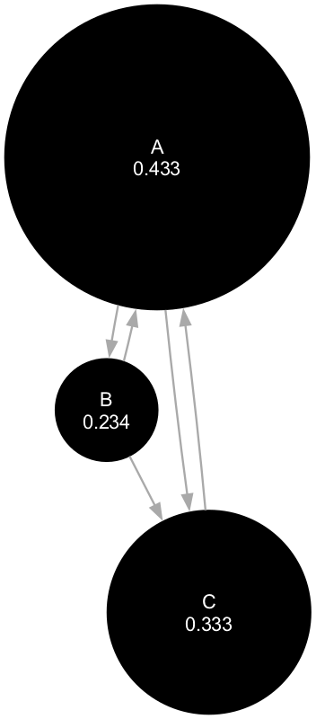
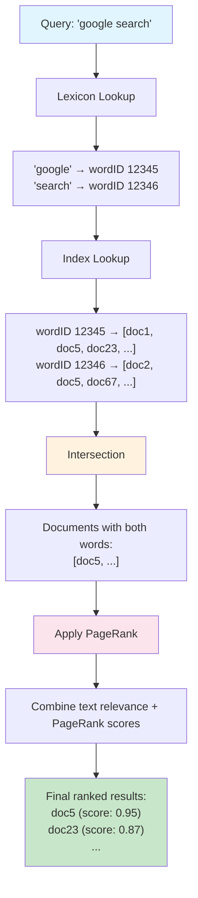

# PageRank (1998)

## Search Engine Requirements
- Fast crawling
- Efficient storage for indices
- Indexing must process hundreds of GBs
- Queries should be fast
- Query throughput 100K/s

## Design Goals
- Search engines had good coverage but bad search quality
- Junk results wash out results the user is interested in
- Attain very high precision (even at the expense of recall)
- Build a [Spacelab](https://en.wikipedia.org/wiki/Spacelab)-like environment for researchers to do experiements on web data (a research tool)

## Hypothesis
- "Hypertext information can help, in particular link structure and link text to do relevance judgements and quality filtering"

## System Features

### 1. Citation Graph
Use link structure to calculate quality ranking for each webpage

Citation important corresponds well to people's subjective idea of improtance. 

**PageRank** (probability distribution over web pages)

$$PR(A) = (1-d) + d \sum_{i=1}^{n} \frac{PR(T_i)}{C(T_i)}$$

PR(A) = (1-d) + d(PR(T1)/C(T1) + ... + PR(Tn)/C(Tn))

**First term (1-d):** base probability that user lands on page A by jumping randomly  
**Second term d(...):** probability that a surfer reaches page A by following links from other pages

**Where:**
- **A:** Page
- **C(A):** Num links going of out Page A
- **d:** damping factor, usually 0.85
- **T1...Tn:** Citations
- **C(T1):** Number of outbound links from page T1
- **PR(T1)/C(T1):** "link equity" passed from page T1 to each page it links to. this is the key insight, each page distributes its PageRank equally among pages it links to. If page T1 has PageRank = 0.6 and links to 2 pages, each link gets 0.6/2 = 0.3

#### Intuition 1
- Random surfer that clicks links, never hits back, and sometimes starts on a random page
- Probability that random surfer vistis a page is the PageRank
- Damping factor d is the probability at each page that the random surfer gets bored and goes to another random page
- **(1-d):** means it gets bored and jumps to a completeley random page on the web. 
- **(1-d):** prevents dead ends or pages without outbound links (dangling nodes), guarantees convergence, models real behavior of typing new urls, fresh searches, etc
- Page rank formula describes how probability flows in the system towards convergence

#### Intuition 2
- High PageRank means many pages point to it, specially if the pages themselves have a high pagerank
- PageRank recursively propagates weights through the link structure

### 2. Anchor Text
Use link text to improve quality results
- before anchors were not associated to the links they point to
- anchors provide more accurate descriptions of web pages than pages themselves
- anchors may exist for docs that cannot be indexed by text-based serach engine, eg. images, programs, dbs
- doesn't say how it's used

### Iterative algo 

`python examples/1.py`

| Iteration | Page A | Page B | Page C | Max delta |
|-----------|--------|--------|--------|-----------|
| 1         | 0.48   | 0.19   | 0.33   | 0.14      |
| 2         | 0.41   | 0.25   | 0.33   | 0.06      |
| 3         | 0.44   | 0.23   | 0.33   | 0.03      |
| 4         | 0.43   | 0.24   | 0.33   | 0.01      |

<!-- add example_2_plot --> 

Notes:
- Page A converges to highest pagerank (~0.43) because it receives links from both B and C
- Page C maintains steady score (~0.33) 
- Page B has lowest score (~0.24) as it only receives one incoming link

## Search Engine

### Offline 
1. Crawl web: collect documents and links
2. Compute PageRank: importance for all pages
3. Build inverted index: keyword to document mappings
4. Build lexicon: word to wordID mappings 

### Online  
1. Parse query
2. Lookup lexicon  
3. Index lookup
4. Find intersection for docs containing query terms
5. Apply ranking: text relevance + pageRank
6. Return final score list

relationship inbound links to pagerank

